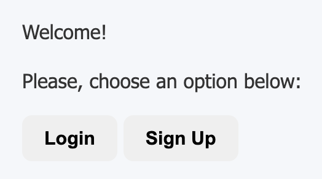
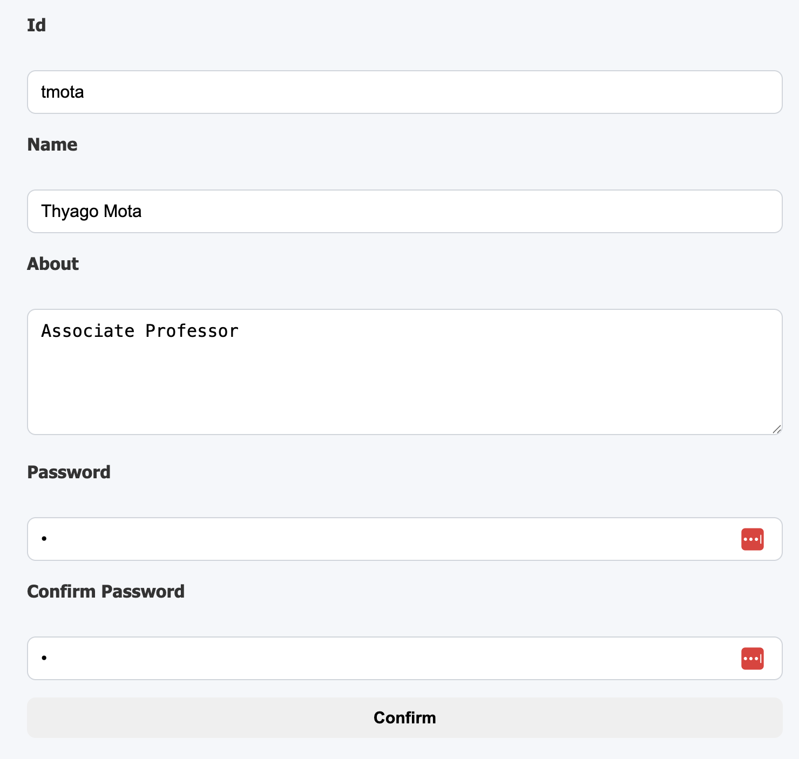
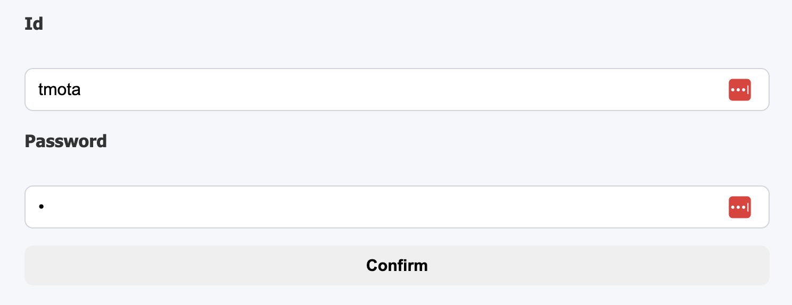
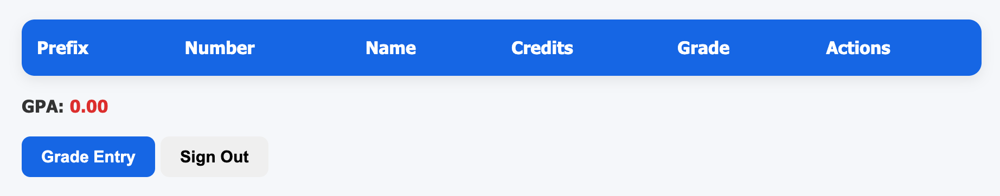
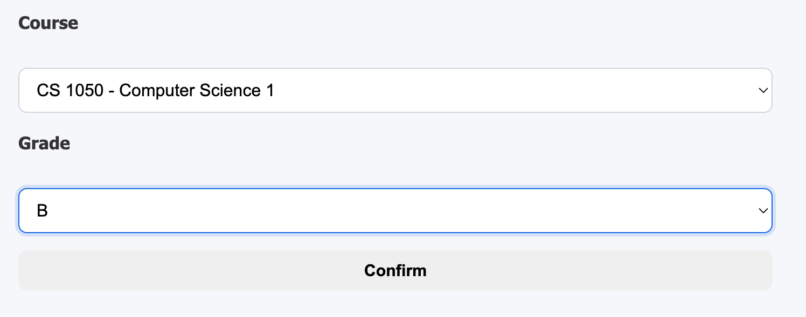
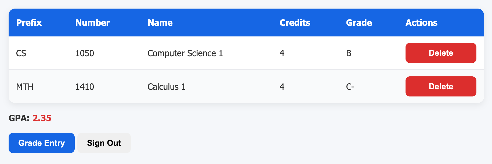
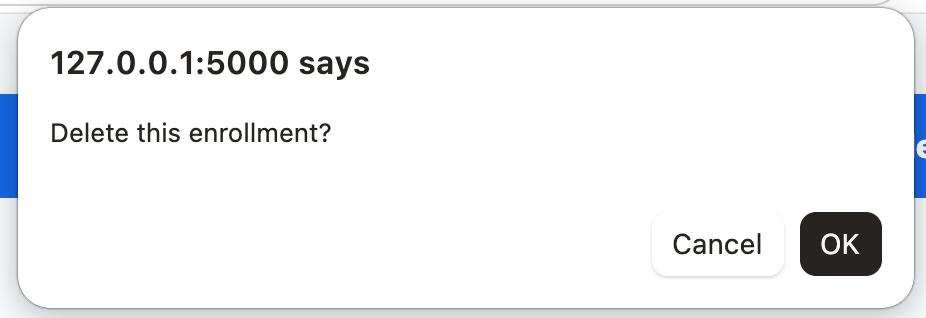

# Overview

Your team has been hired to develop a simple web application that allows students to track their GPAs. This project serves as an initial proof of concept to demonstrate your team's capabilities before it is assigned a more complex task. Because the project's requirements are well defined and its scope is limited, the team has chosen the Waterfall process model, following its traditional phases which include:

* Communication: gathering and understanding requirements
* Planning: defining schedules, resources, and milestones
* Modeling: designing system architecture and data models
* Construction: implementing and testing the application
* Deployment: delivering the final product to users

# Communication Phase

## Overview

The project involves developing a web application that allows students to track their GPAs. Students should be able to register for the application and, after successfully logging in, enter completed courses along with their corresponding letter grades. The application should display all previously entered courses and calculate the student's overall GPA. Students should also be able to update their letter grades if they were entered incorrectly.

## Objectives 

* Track previously completed courses for each student, including their letter grades.
* Calculate and display the student's overall GPA.

## Requirements 

1. Users must be able to authenticate themselves.
2. Students (authenticated users) must be able to view all previously completed courses.
3. Students must be able to view their current GPA.
4. Students must be able to update the letter grade for a course.
5. Students must be able to delete a previously completed course.

## Constraints 

* A working version of the web application is expected to be delivered in 3 weeks. 
* The implementation team is limited to 3 to 5 members. 
* The software must be implemented in Python, Flask, and SQLAlchemy. 

## Risks 

* The project team has limited experience with some of the technologies and tools being used.

# Planning Phase

## Schedule 

Estimate a schedule for this project by completing the table below. 

|Phase|Task|Start|End|Duration|Deliverable|
|---|---|---|---|---|---|
|Modeling|Requirements Analysis|mm/dd/26|mm/dd/26|99 days|Use Case Diagram|
|Modeling|Data Model|mm/dd/26|mm/dd/26|99 days|Class Diagram|
|Construction|Coding|mm/dd/26|mm/dd/26|99 days|Code|
|Construction|Testing|mm/dd/26|mm/dd/26|99 days|Test Report|
|Deployment|Delivery|mm/dd/26|mm/dd/26|99 days|Final Commit/Push|

## Team Roles

Assign roles to each team member by completing the table below. A member may take on more than one role.

|Name|Role(s)|
|--|--|
|name|manager,developer,tester,documenter|

# Modeling Phase

## Requirements Analysis 

Based on the project description, perform a requirements analysis by developing a UML use case diagram that captures the system's key functionalities and user interactions.

## Data Model 

Based on the data model defined in [src/models.py](src/models.py), create a UML class diagram to document the system's structure. The model includes the following entities:

* User: id, name, about, and password.
* Courses: prefix, number, name, credits
* Enrollment: user_id, course_prefix, course_number, grade

Make sure that your class diagram shows the association between **User**, **Course**, and **Enrollment**. 

## Baseline Implementation

A baseline for the web app is given in **Flask**. The project should be structured like the following: 

```
.venv
pics
src
|__app
|____ __init__.py
|____ modes.py
|____ routes.py
|____ forms.py
|__ init_db.py
instance
|__ prj1.db
static
|__ style.css
templates
|__ base.html
|__ index.html
|__ login.html
|__ signup.html
|__ create_enrollment.html
|__ enrollments.html
uml
|__ class.wsd
|__ use_case.wsd
README.md
requirements.txt
Dockerfile
```

[.venv](.venv) should not be pushed to the remote repository. Be sure to add it to your [.gitignore](.gitignore) file to exclude it from version control.

# Implementation Phase

Create a public GitHub repository for your project. Add all team members as collaborators. Share the URL of your repo with your instructor:  

```
Project's GitHub Repository: <<URL>>
```

Following software development collaboration best practices, create a **dev** branch to manage beta versions of your project. Additionally, each team member should create local temporary branches for individual development and testing tasks. Once the **dev** branch reaches a stable state, merge it into the **main** branch. The **main** branch should be protected. 

To run an initial course load, modify [src/init_db.py](src/init_db.py) to insert at least 5 courses of your choice. 

As part of the project requirements, you must create your own **gpa_calculator** library according to the provided model. The library must be packaged and published to PyPI so that it can be installed using pip. 

Before beginning implementation, a team representative must meet with the instructor for a **mandatory** checkpoint. This can be done eiter in person or online. Either way, it needs to be scheduled. Be prepared to present the following:

* Use case and class diagrams
* A working baseline implementation of the app
* The **main** branch is protected
* A draft project schedule
* Team role assignments

# Testing Phase

At this stage, you are NOT expected to write automated tests. Instead, you should perform manual testing, documenting your test results using the table provided below.

|Functionality Tested|Date|Time|Result|
|--|--|--|--|
|Sign Up|99/99/23|99:99|passed|
|...|...|...|...|

# Deployment Phase

Create a Docker image to allow the instructor to run your project in a containerized environment. To meet this requirement, include a **Dockerfile** in your repository that enables the instructor to build the image and run the application as a container.

# Team Evaluation 

Students should use this [form](https://forms.cloud.microsoft/r/RiQbbB9VhD) to evaluate their team members and complete a self-evaluation. This is a mandatory requirement, and the team's grade will be placed on hold until all members have submitted their evaluations.

# Rubric 

```
+5 Planning: Schedule
+5 Planning: Team Roles 
+5 Modeling: Use Case Diagram 
+5 Modeling: Class Diagram
+5 Check-point
+10 Courses data load
+5 Authentication
+10 List of Enrollments
+10 Create Enrollment
+10 Delete Enrollment
+10 GPA Calculation and Display
+10 GPA PyPI build and deployment
+5 Testing 
+5 Deployment
-25 Team/Self Evaluation
-5 main branch not protected
```

# User Interface Suggestions














